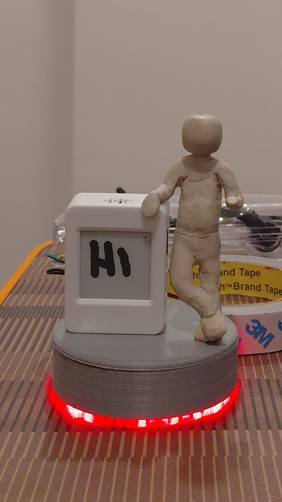

## TheLink ESP32-S3

MQTT-controlled embedded device driving an e-paper display, RGB LED strip, and audio output.

### Requirements

- ESP-IDF v5.x with ESP-IDF shell environment
- LVGL Minimal Configuration enabled (`CONFIG_LV_USE_PERF_MONITOR` OFF to save heap)
- MQTT v5 broker (default: `mqtt://broker.emqx.io`)
- SD card (FAT32) mounted at `/sdcard`

### Setup the ESP-IDF environment

The IDF tools live in `$env:IDF_PATH`, which must point at the ESP-IDF install
that actually has its toolchain installed (e.g.
`C:\Espressif\frameworks\esp-idf-v5.4.1` for the Espressif installer layout, or
`/opt/esp/idf` inside the devcontainer). Tools and toolchains are *not* tied to
a bare `git clone` of ESP-IDF — running the export script from such a clone
fails with `tool ... has no installed versions`.

In a new PowerShell terminal, set `IDF_PATH` and load the environment, then go
to the project:

```powershell
# Point at your installed ESP-IDF, then export its tools onto PATH
$env:IDF_PATH = "C:\Espressif\frameworks\esp-idf-v5.4.1"
& "$env:IDF_PATH\export.ps1"

cd E:\Savio\Embedded\ESP\TheLink
```

Notes:
- The export must be repeated in every new terminal (environment variables are
  per-session). To avoid it, set `IDF_PATH` permanently (System → Advanced
  system settings → Environment Variables → user variable `IDF_PATH`) or use the
  **"ESP-IDF PowerShell"** shortcut from the Start menu, which exports the
  correct environment automatically.
- A stale `IDF_PATH` (e.g. from a user/machine env var pointing at an older
  clone) overrides the new value inside already-open terminals. Restart the
  terminal after changing it, or set it in-session as above.
- `scripts/build.py` and `scripts/flash_all.py` auto-locate the ESP-IDF Python
  environment, so they work without the export. The export is still required to
  call `idf.py`, `esptool.py`, or `menuconfig` directly.

### Build & Flash

A single switch selects the build profile (`scripts/build.py`). **Dev is the
default**: `sdkconfig.defaults` points at `partitions_dev.csv`, so a plain
`python3 scripts/build.py` (or bare `idf.py build`) gives a development build.

- **Dev** (default) — standard partition table **without OTA**
  (`partitions_dev.csv`). The app is flashed straight to the `factory`
  partition with a plain `idf.py flash`; the `esp32_factory_app` bootloader is
  **not** used. Builds go to `build-dev`.
- **Prod** — production partition table for OTA via the `esp32_factory_app`
  bootloader (`partitions.csv`: `factory` + `ota_0`). Builds go to `build`.

The IDF Python tools are launched with the `python3` interpreter.

```bash
# Development build (no OTA) — default profile
python3 scripts/build.py
python3 scripts/build.py flash

# Production build (esp32_factory_app OTA)
python3 scripts/build.py -p Prod
python3 scripts/build.py -p Prod flash
```

Manual equivalents:

```bash
# Dev (default): standard single-app partition table, no OTA
python3 $IDF_PATH/tools/idf.py -B build-dev build
python3 $IDF_PATH/tools/idf.py -B build-dev flash

# Prod: OTA table (factory = esp32_factory_app, ota_0 = main app)
python3 $IDF_PATH/tools/idf.py -B build -DSDKCONFIG_DEFAULTS="sdkconfig.defaults;sdkconfig.prod" build
```

For production, the firmware is flashed to the `ota_0` partition; the
`factory` partition holds the bootloader app (`esp32_factory_app`). Flash both
apps (and the shared bootloader/partition table) with
`python3 scripts/flash_all.py`.

---

## MQTT Topics

All topics are per-device, derived from the last 3 bytes of the factory MAC address.

| Topic | Direction | QoS | Purpose |
|-------|-----------|-----|---------|
| `thelink/{device_id}/cmd/display` | Subscribe | 1 | Send image display commands |
| `thelink/{device_id}/cmd/rgb` | Subscribe | 1 | Send RGB LED pattern commands |
| `thelink/{device_id}/cmd/audio` | Subscribe | 1 | Send audio playback commands |
| `thelink/{device_id}/cmd/notification` | Subscribe | 1 | Send LED notification commands |
| `thelink/{device_id}/cmd/ota` | Subscribe | 1 | Trigger firmware update download |
| `thelink/{device_id}/cmd/log` | Subscribe | 1 | Send logger control commands |
| `thelink/{device_id}/evt/ota` | Publish | 1 | Firmware update status events |
| `thelink/{device_id}/evt/log` | Publish | 0 | Device log output (JSON) |
| `company/command` | Subscribe | 2 | Legacy topic (backward compatible) |

Device ID format: `thelink-XXYYZZ` (e.g. `thelink-0A1B2C`)

---

## Command Schemas

### Display (`thelink/{device_id}/cmd/display`)

Downloads an image from a URL, saves it to SD card, and renders it on the e-paper display.

```json
{
  "download": "http://example.com/image.i8",
  "filename": "image.i8"
}
```

| Field | Type | Required | Description |
|-------|------|----------|-------------|
| `download` | string | Yes | HTTP(S) URL to download the image from |
| `filename` | string | Yes | Target filename on SD card (saved to `/sdcard/{filename}`) |

Image format: LVGL I8 (indexed 8-bit, 200x200, with 256-color palette).

### RGB LED (`thelink/{device_id}/cmd/rgb`)

Sets the LED strip pattern.

```json
{
  "pattern": "scanner"
}
```

| Field | Type | Required | Description |
|-------|------|----------|-------------|
| `pattern` | string | Yes | Pattern name (see table below) |

**Available patterns:**

| Pattern | Description |
|---------|-------------|
| `solid_color` | Single static color (default when inactive) |
| `rainbow_cycle` | Smooth rainbow cycle across all LEDs |
| `theater_chase` | Theater-style chasing light effect |
| `color_wipe` | Sequential color fill |
| `scanner` | Scanning light sweep back and forth |
| `fade` | Breathing fade effect |

### Audio (`thelink/{device_id}/cmd/audio`)

Queues an audio file for playback.

```json
{
  "filename": "alert.wav",
  "volume": 80
}
```

| Field | Type | Required | Description |
|-------|------|----------|-------------|
| `filename` | string | Yes | Audio file path on SD card |
| `volume` | number | No | Playback volume 0-100 |

### Notification (`thelink/{device_id}/cmd/notification`)

Activates an LED pattern as a notification alert.

```json
{
  "message": "scanner"
}
```

| Field | Type | Required | Description |
|-------|------|----------|-------------|
| `message` | string | Yes | Pattern name (same values as RGB `pattern` field) |

### Firmware Update (`thelink/{device_id}/cmd/ota`)

Downloads a firmware image to the SD card, prints "Update in progress" on the
e-paper, and reboots into the bootloader app (`factory` partition), which
flashes the image from `/sdcard/update.bin` into `ota_0`.

```json
{
  "download": "https://example.com/theLink_esp32s3.bin",
  "version": "0.4.0"
}
```

| Field | Type | Required | Description |
|-------|------|----------|-------------|
| `download` | string | Yes | HTTP(S) URL of the ESP-IDF app image (.bin) |
| `version` | string | No | New firmware version (logged, informational) |

Update progress is published to `thelink/{device_id}/evt/ota` as JSON with
a `status` of `started`, `downloaded`, `rebooting`, or `failed`.

### Log Control (`thelink/{device_id}/cmd/log`)

Controls the remote log level filter. Serial output is unaffected.

```json
{
  "action": "set_level",
  "level": "debug"
}
```

```json
{
  "action": "get_level"
}
```

| Field | Type | Required | Description |
|-------|------|----------|-------------|
| `action` | string | Yes | `"set_level"` or `"get_level"` |
| `level` | string | For `set_level` | `"error"`, `"warn"`, `"info"`, `"debug"`, `"verbose"`, or `"none"` |

---

## Event Output

### Log Events (`thelink/{device_id}/evt/log`)

Published as JSON with QoS 0:

```json
{
  "device_id": "thelink-0A1B2C",
  "level": "info",
  "tag": "app",
  "msg": "Display download complete"
}
```

---

## Legacy Topic

The device also subscribes to `company/command` (QoS 2) for backward compatibility. Messages on this topic use the old format:

```json
{
  "type": "display",
  "data": {
    "download": "http://example.com/image.i8",
    "filename": "image.i8"
  }
}
```

Supported `type` values: `"display"`, `"notification"`.

---

## Configuration

Build-time options in `menuconfig` (`Example Configuration`):

| Option | Default | Description |
|--------|---------|-------------|
| `CONFIG_BROKER_URL` | `mqtt://broker.emqx.io` | MQTT broker address |
| `CONFIG_COMMAND_TOPIC` | `company/command` | Legacy command topic |

---

## Version History

### v0.3.0
- Per-subsystem MQTT topics with dedicated handlers
- Dispatch table architecture for topic-based command routing
- Removed legacy `instructions_t` state duplication
- JSON payload logging downgraded to DEBUG level
- Global MQTT client handle for future publish use

### v0.2.0
- RGB LED strip control via MQTT
- `RgbLedStrip` class with `runPattern()` interface
- Pattern selection via MQTT `notification` command

### v0.1.0
- MQTT v5 protocol support
- E-paper display image download and render
- Wi-Fi provisioning (BLE/SoftAP)
- SD card image storage