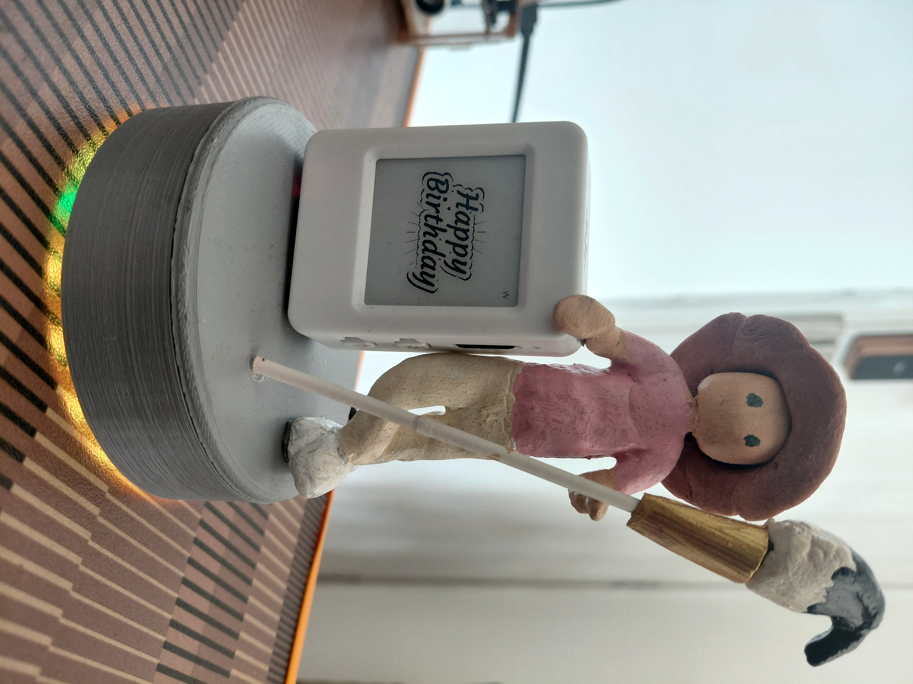

# theLink

theLink is a device to send a surprise to a friend that quietly turns up on their
desk — no buzzing phone, no notification. The message arrives as a picture on
the e-paper screen, a glow from the LED ring, maybe a sound from the speaker.

Everything lives on one small waveshare unit, and one extra ring of LEDs makes it glow.

- Built right in: 1.54-inch e-paper display, ESP32-S3 (Wi-Fi + Bluetooth), speaker, microphone, microSD card reader
- I've added a 16-LED NeoPixel ring (the notification LED)
- Messages arrive over Wi-Fi via MQTT (default broker: `mqtt://broker.emqx.io`)
- First-time setup over Bluetooth by scanning a QR code

---

## 1. What is it

**The unit** — a Waveshare 1.54-inch ESP32-S3 e-paper module. It comes as one
package and already contains:

| Piece | What it does |
|-------|--------------|
| E-paper display (200x200) | Shows images, all day, with almost no power |
| ESP32-S3 chip | The brain — Wi-Fi + Bluetooth built in |
| Speaker | Plays sound files |
| Microphone | (available for future projects) |
| microSD reader | Stores images and sounds on a card |
| SHTC3 temperature + humidity sensor | Reports the air around it, every 5 minutes |

**Additional**

| Piece | Why |
|-------|-----|
| 16-LED NeoPixel ring | The glowing "notification LED", data pin wired to GPIO 2 |
| microSD card (FAT32) | Holds the images and sounds the device downloads |
| USB-C data cable | For the one-time software flash |
| External Button  | For the one-time Wi-Fi setup (Bluetooth) |
| Computer | For the one-time software flash |
| Android phone | For the ESP BLE Provisioning app and IoTHome MQTT dashboard builder app.

**Software you'll use:**

- **MQTTX** — a free app (desktop or phone) for sending and watching messages. This is how the surprise travels to my friend's via theLink.
- **Espressif Provisioning** app (phone) — scans the QR code on the e-paper to give the device a Wi-Fi name and password.

---

## 2. First power-up

1. **Flash the software once.** This needs the ESP-IDF environment set up first
   (only once per computer, and repeated for every new terminal):

   ```powershell
   $env:IDF_PATH = "C:\Espressif\frameworks\esp-idf-v5.4.1"
   & "$env:IDF_PATH\export.ps1"
   ```

   Then, from the project folder:

   ```bash
   python3 scripts/build.py flash
   ```

2. **Reset Provisioning:** hold the reset button at the rear
   (GPIO 3) down while powering it up and keep holding for about 1 second.
3. **Power on.** After a moment the e-paper shows a QR code and the LED ring starts pulsing.
4. **Add Wi-Fi:** open the Espressif Provisioning app, scan the QR code, and enter the Wi-Fi network name and password.
5. **Done.** The LED ring stops pulsing once it connects — the device is ready.

### LED ring indicators during provisioning

The ring shows which stage of setup it is in:

| Effect | What it means |
|---------|---------------|
| Fast blue pulse (every 0.5 s) | Provisioning is active — it's waiting for a phone |
| Medium blue pulse (every 1.5 s) | A phone is connected over Bluetooth |
| Slow blue pulse (every 3 s) | It connected to the Wi-Fi |
| Ring does behaves as MQTT messages say | Setup is complete |

---

## 3. MQTT Communication

MQTT is how a message travels from me to my friend's theLink over Wi-Fi. It works like a post office:

- **Broker** = the post office in the middle (there's a free public one at `broker.emqx.io`).
- **Topic** = a mailbox name. The device checks certain mailboxes and ignores the rest.
- **Message** = the letter inside the mailbox. JSON text

**Heads-up:** `0A1B2C3D4E5F` in the topics below is a placeholder — it stands for
the 6-byte MAC address of the ESP32 chip in use. Section 4 shows 
how to find the MAC and swap it in.

Topics come in two flavours:

| Kind | Looks like | Meaning |
|------|-----------|---------|
| `cmd/` (commands) | `thelink/0A1B2C3D4E5F/cmd/rgb` | Mailboxes the device **reads** — where to post messages |
| `evt/` (events) | `thelink/0A1B2C3D4E5F/evt/led` | Mailboxes the device **writes** — its replies |

**First 60 seconds with MQTTX:**

1. Open MQTTX and add a connection to `broker.emqx.io` (port `1883`).
2. Subscribe (listen) to topic `thelink/0A1B2C3D4E5F/evt/#` (remember: replace `0A1B2C3D4E5F` with device's ID).
3. Publish (send) to topic `thelink/0A1B2C3D4E5F/cmd/rgb` this message:

   ```json
   { "pattern": "rainbow_cycle" }
   ```

4. The ring goes rainbow. First message delivered

If you built the firmware with a broker URL or credentials (see
[MQTT broker settings](#mqtt-broker-settings)), MQTTX has to point at the same
broker, with the same username and password.

---

## 4. Find the device ID

Every example in this guide uses the placeholder device ID `0A1B2C3D4E5F`.
**Your device has its own.** It is the 6-byte factory MAC address of your board,
written as uppercase hex with no dashes — format `UUVVWWXXYYZZ`.

How to see yours:

- **Boot log:** the serial monitor prints `Device ID: UUVVWWXXYYZZ` at startup.

Whatever it is, swap it in wherever you see `0A1B2C3D4E5F` below.

---

## 5. The messages you can send — copy and paste ready

Pick a section, copy the topic, copy the message, and paste them into MQTTX.

### 5.1 Show an image — `cmd/display`

Downloads a picture from the server, saves it on the SD card, and shows it on the e-paper.

- **Topic:** `thelink/0A1B2C3D4E5F/cmd/display`
- **Publish this:**

  ```json
  {
    "download": "http://example.com/myphoto.bin",
    "filename": "myphoto.bin"
  }
  ```
- **You should see:** the e-paper refresh and show the new image.

| Field | Type | Required | Description |
|-------|------|----------|-------------|
| `download` | string | Yes | The web address (URL) of the image |
| `filename` | string | Yes | What to call the file on the SD card (`/sdcard/…`) |

**Before you send an image — turn your photo into e-paper format.**

The screen is monochrome and 200x200. Ordinary JPG/PNG files won't work: you first
convert yours into the special `.bin` format the screen understands, host it on your
own HTTP server, then point the message at it.

1. **Convert your photo** with the included script (run it on your computer, in the
   project folder):

   ```bash
   python3 scripts/png_to_epaper.py myphoto.png myphoto.bin
   ```

   Useful extra options: `--threshold <0-255>` (brightness cut-off, default 128),
   `--invert` (swap black and white), and `--preview` (saves a `_preview.png` so you
   can check the result before sending).

2. **Host the file on your own HTTP server** — it must be reachable from the device.
   The quickest way, from the folder containing the `.bin`:

   ```bash
   python3 -m http.server
   ```

   Now your file is available at `http://<your-server-ip>:8000/myphoto.bin`.

3. **Use that link as `download`** — the URL of the `.bin` on your server goes into
   the message:

   ```json
   {
     "download": "http://192.168.1.50:8000/myphoto.bin",
     "filename": "myphoto.bin"
   }
   ```

Notes: images must be LVGL I8 format (indexed 8-bit, 200x200, with a 256-colour
palette) — exactly what `png_to_epaper.py` produces.

---

### 5.2 The RGB LED ring — `cmd/rgb`

The most fun one. The ring has 16 LEDs and supports patterns, colours, brightness,
per-LED colours, and an auto-off timer. Every field is optional — only send what you
want to change.

- **Topic:** `thelink/0A1B2C3D4E5F/cmd/rgb`

**Solid colour:**

```json
{
  "enable": true,
  "pattern": "solid_color",
  "color": { "h": 210, "s": 100, "v": 60 }
}
```

**Rainbow slowly cycling:**

```json
{
  "pattern": "rainbow_cycle",
  "speed": 40
}
```

**Per-LED colours (LED 0 red, LED 1 green, LED 2 off, rest skipped):**

```json
{
  "pixels": ["#FF0000", "#00FF00", null],
  "brightness": 75
}
```

**Turn on, then off by itself after 30 seconds (timer + colour as hex):**

```json
{
  "pattern": "scanner",
  "color": "#00AAFF",
  "duration": 30
}
```

**Turn the ring off:**

```json
{ "enable": false }
```

- **You should see:** the ring change immediately, and a reply arrive on `evt/led` with the new state.

**Patterns you can use:**

| Pattern | Description |
|---------|-------------|
| `off` | Turn the strip off |
| `solid_color` | Single steady colour |
| `rainbow_cycle` | Smooth rainbow cycling across all LEDs |
| `theater_chase` | Theatre-style chasing lights |
| `color_wipe` | One colour wipes across the ring |
| `scanner` | A light sweeping back and forth |
| `fade` | Gentle breathing fade |

**All the fields:**

| Field | Type | Values / default | Description |
|-------|------|------------------|-------------|
| `enable` | bool | `true` / `false` | Master on/off; `false` turns the ring off immediately |
| `pattern` | string | see table above | Which pattern to run (also switches the ring on) |
| `color` | string or object | `"#RRGGBB"`, or `{"h":0-360,"s":0-100,"v":0-100}`, or `{"r","g","b":0-255}` | The colour to use |
| `brightness` | number | 0–100 (default 100) | Global brightness, dims everything |
| `speed` | number | 5–5000 ms (default 20) | How fast patterns animate — lower is faster |
| `pixels` | array | up to 16 entries | Colour each LED by hand; `null` skips an LED and overrides `pattern` while present |
| `duration` | number | seconds | Auto-off after this long (0 or absent = stay on) |
| `persist` | bool | default `true` | Save the state to the SD card so it survives a reboot |

---

### 5.3 Notification alert — `cmd/notification`

A shortcut that turns on the ring with a pattern (the same patterns as `cmd/rgb`).

- **Topic:** `thelink/0A1B2C3D4E5F/cmd/notification`
- **Publish this:**

  ```json
  {
    "message": "scanner"
  }
  ```

- **You should see:** the ring start the `scanner` pattern.

| Field | Type | Required | Description |
|-------|------|----------|-------------|
| `message` | string | Yes | Pattern name (same list as section 5.2) |

---

### 5.4 Play a sound — `cmd/audio`

Plays an audio file through the speaker. The file can already be on the SD card,
or the device can download it first.

**Play a file already on the SD card:**

- **Topic:** `thelink/0A1B2C3D4E5F/cmd/audio`
- **Publish this:**

  ```json
  {
    "download": "",
    "filename": "alert.wav",
    "volume": 80
  }
  ```

**Download a file, then play it:**

  ```json
  {
    "download": "http://example.com/alert.wav",
    "filename": "alert.wav",
    "volume": 80
  }
  ```

- **You should hear:** the sound over the speaker.

| Field | Type | Required | Description |
|-------|------|----------|-------------|
| `download` | string | Yes | Web address of the sound — use an empty string `""` if the file is already on the SD card |
| `filename` | string | Yes | The file to play (saved to `/sdcard/…` when downloading) |
| `volume` | number | No | Volume 0–100 |

---

### 5.5 Update the firmware — `cmd/ota`

Downloads a brand-new version of the device software, shows "Update in progress"
on the screen, then restarts itself with the new code.

- **Topic:** `thelink/0A1B2C3D4E5F/cmd/ota`
- **Publish this:**

  ```json
  {
    "download": "https://example.com/theLink_esp32s3.bin",
    "version": "0.4.0"
  }
  ```

- **You should see:** "Update in progress" on the e-paper, then the device reboots.
  Progress replies arrive on `evt/ota` (`started`, `downloaded`, `rebooting`, `failed`).

| Field | Type | Required | Description |
|-------|------|----------|-------------|
| `download` | string | Yes | Web address of the firmware file (an ESP-IDF app image `.bin`) |
| `version` | string | No | Just for the logs and events |

Like images (section 5.1), the firmware file must first exist on your own HTTP
server — put the `.bin` somewhere the device can reach and point `download` at
that file's URL. No conversion step is needed; the firmware is already an ESP-IDF
app image.

---

### 5.6 Control the logs — `cmd/log`

Changes how loudly the device talks on `evt/log`. Handy when debugging.

- **Topic:** `thelink/0A1B2C3D4E5F/cmd/log`

**Set the log level to debug (most talkative):**

```json
{
  "action": "set_level",
  "level": "debug"
}
```

**Check the current level:**

```json
{
  "action": "get_level"
}
```

| Field | Type | Required | Description |
|-------|------|----------|-------------|
| `action` | string | Yes | `"set_level"` or `"get_level"` |
| `level` | string | for `set_level` | `"error"`, `"warn"`, `"info"`, `"debug"`, `"verbose"`, or `"none"` |

---

### 5.7 Check on the status of theLink — `cmd/status`

Query the device for its status, what is its state.

- **Topic:** `thelink/0A1B2C3D4E5F/cmd/status`

**Ask for the status (any payload works, even an empty one):**

```json
{}
```

- **You should see:** a reply on `evt/status` (section 6) with the current
  firmware version, the LED pattern, the image on the e-paper, the latest
  temperature and humidity reading, and a few supporting details.

The command takes no fields — it is a bare query, so an empty message is fine.
Nothing is changed by sending it, and the reply is **not** retained.

---

## 6. What the device sends back (events)

These are mailboxes the device **writes** to. Subscribe to them to watch what
theLink is doing.

### `evt/led` — the ring's state (retained)

Every time the ring accepts a command, the device replies with the full current
state. The message is **retained**, so anyone who subscribes later immediately
gets the latest state — no need to wait.

- **Topic:** `thelink/0A1B2C3D4E5F/evt/led`

```json
{
  "active": true,
  "pattern": "rainbow_cycle",
  "color": { "h": 210, "s": 100, "v": 60 },
  "brightness": 75,
  "speed": 40,
  "pixels": ["#FF0000", null],
  "cmd_id": 12
}
```

### `evt/ota` — firmware update progress

- **Topic:** `thelink/0A1B2C3D4E5F/evt/ota`

```json
{
  "status": "downloaded",
  "detail": "/sdcard/update.bin"
}
```

`status` is one of `started`, `downloaded`, `rebooting`, or `failed`.

### `evt/sensor` — temperature and humidity (retained)

The built-in SHTC3 sensor takes a reading shortly after boot and then every
5 minutes. The message is **retained**, so a dashboard that subscribes at any
time immediately gets the most recent reading instead of waiting for the next
one, and the device re-publishes it every time it reconnects to the broker.

- **Topic:** `thelink/0A1B2C3D4E5F/evt/sensor`

```json
{
  "temperature_c": 24.31,
  "humidity_pct": 41.19,
  "age_ms": 12430
}
```

| Field | Type | Description |
|-------|------|-------------|
| `temperature_c` | number \| null | Air temperature in degrees Celsius |
| `humidity_pct` | number \| null | Relative humidity, 0-100 |
| `age_ms` | number | How long ago this reading was taken. Absent when there is no reading |

This topic is **publish-only** — there is no `cmd/sensor` command, because
there is nothing to configure about a thermohygrometer. To read the value right
now, use `cmd/status` (section 5.7), which folds the same numbers into its
`sensor` object.

If a read fails (sensor not yet powered, bus error, or a bad checksum) the
device logs a warning and keeps the previous reading rather than publishing a
blank one, so a stale number is never silently replaced by `null`. The
temperature and humidity fields are `null` only until the very first successful
sample. Each read is attempted three times before the cycle gives up, and the
first attempt is held back until about two seconds after boot so it does not
race the audio codec coming up on the same I2C bus.

At boot the driver also reads the sensor's ID register and logs it, e.g.
`SHTC3: ID 0x0910 (CRC ok)`. That is the quickest way to tell a working sensor
from a dead one: no ID line, or a CRC failure, means the part never identified
itself. See the troubleshooting table (section 7).

### `evt/status` — answer to `cmd/status`

- **Topic:** `thelink/0A1B2C3D4E5F/evt/status`

```json
{
  "version": "0.4.0",
  "rgb_pattern": "rainbow_cycle",
  "image": "/sdcard/dog.bin",
  "device_id": "0A1B2C3D4E5F",
  "sensor": {
    "temperature_c": 24.31,
    "humidity_pct": 41.19,
    "age_ms": 12430
  },
  "partition": "ota_0",
  "uptime_ms": 128430,
  "free_heap": 214032,
  "min_free_heap": 180112,
  "build": { "date": "Sep 26 2026", "time": "11:42:07", "idf": "v5.4.1" }
}
```

| Field | Type | Description |
|-------|------|-------------|
| `version` | string | Firmware version (matches `version.txt`) |
| `rgb_pattern` | string | LED pattern currently selected — one of `off`, `solid_color`, `rainbow_cycle`, `theater_chase`, `color_wipe`, `scanner`, `fade` |
| `image` | string \| null | Full SD path of the image **currently on the e-paper**, or `null` if nothing has been rendered yet |
| `device_id` | string | Same device ID you used in the topic |
| `sensor` | object | Cached temperature and humidity — `temperature_c`, `humidity_pct`, and `age_ms`. `null` values until the first sample succeeds. Same contents as `evt/sensor` |
| `partition` | string \| null | App partition being executed (`ota_0` in a production build) |
| `uptime_ms` | number | Milliseconds since boot |
| `free_heap` | number | Free internal heap, in bytes |
| `min_free_heap` | number | Lowest free heap reached since boot, in bytes |
| `build` | object | `date`, `time` and IDF `version` of this build. Omitted if the build has no compile timestamp |

`image` only advances once a picture has been unpacked and pushed to the screen,
so it never claims to be showing an image that failed to download or render.
It starts out as `null` after a reboot and fills in once the e-paper has been
drawn.

`sensor` is a cache, not a live read: asking for the status never blocks on I2C,
so it stays fast. Use `age_ms` to tell a fresh reading from one taken at boot.

### `evt/log` — the device's diary

- **Topic:** `thelink/0A1B2C3D4E5F/evt/log`

```json
{
  "device_id": "0A1B2C3D4E5F",
  "level": "info",
  "tag": "app",
  "msg": "Display download complete"
}
```

---

## 7. Troubleshooting

| Problem | Try this |
|---------|----------|
| LED ring does nothing | Check power; make sure you flashed the firmware (section 2); check Data line connection |
| Ring pulses forever after setup | Wi-Fi credentials didn't save — factory reset (hold reset ~1 s at boot) and re-provision |
| Screen stays blank | Check the SD card is inserted, formatted FAT32, and your file was downloaded (watch `evt/led` isn't enough — check `evt` and the serial log) |
| Nothing happens / no `evt/led` reply | Wrong device ID in the topic, or the broker address doesn't match. Verify the device ID in the boot log |
| Image doesn't show | Convert it first with `python3 scripts/png_to_epaper.py` — it must be LVGL I8, 200x200, with a 256-colour palette, and hosted on your own HTTP server |
| Sound doesn't play | File must exist on the SD card (use `"download": ""` for a file already there) |
| `evt/sensor` never arrives | Start with `ID 0x….  (CRC ok)` and `SHTC3 attached at 0x70`, then the `I2C scan on SDA 47 / SCL 48:` line printed about two seconds after boot. The scan names every device that answered: `0x18` ES8311, `0x51` PCF85063 RTC, `0x70` SHTC3. A missing `0x70`, or an `ID read 0xEFC8 NACKed at 0x70` at attach, is hardware — the sensor never identified itself. If the ID verifies but a read still fails, `measurement command 0x7866 NACKed at 0x70` means it answered the probe and the identity read but not the measurement, and `CRC mismatch` means the bus is noisy. A read is retried three times per cycle, then left to the next 5-minute tick |

---

## 8. Advanced: building and flashing (for maintainers)

This section is for the people updating the software itself. If you just want to
use the device, you can stop reading here.

### ESP-IDF environment

The IDF tools live in `$env:IDF_PATH`, which must point at an ESP-IDF install that
actually has its toolchain installed (e.g. `C:\Espressif\frameworks\esp-idf-v5.4.1`
for the Espressif installer layout). Tools and toolchains are not tied to a bare
`git clone` — running export from such a clone fails with `tool ... has no
installed versions`.

In a new PowerShell terminal:

```powershell
$env:IDF_PATH = "C:\Espressif\frameworks\esp-idf-v5.4.1"
& "$env:IDF_PATH\export.ps1"
```

Notes:

- Export must be repeated in every new terminal (environment variables are per-session).
- A stale `IDF_PATH` overrides the new value inside already-open terminals — restart after changing it.
- `scripts/build.py` and `scripts/flash_all.py` auto-locate the ESP-IDF Python environment, so they work without the export (the export is still needed to call `idf.py`, `esptool.py`, or `menuconfig` directly).
The project uses my [esp32_factory_app](https://github.com/Savio-Cardoz/esp32_factory_app.git) repo as the update flashing app. This app resides in the factory parition.

### Build profiles

A single switch selects the build profile. **Dev is the default** — a plain
`python3 scripts/build.py` gives a development build.

- **Dev** (default) — standard partition table **without OTA** (`partitions_dev.csv`). Flashed straight to the `factory` partition; the `esp32_factory_app` bootloader is not used. Builds go to `build-dev`.
- **Prod** — production partition table for OTA via the `esp32_factory_app` bootloader (`partitions.csv`: `factory` + `ota_0`). Builds go to `build`.

```bash
# Development build (no OTA) — default profile
python3 scripts/build.py
python3 scripts/build.py flash

# Production build (esp32_factory_app OTA)
python3 scripts/build.py -p Prod
python3 scripts/build.py -p Prod flash
```

Manual equivalents:

```bash
python3 $IDF_PATH/tools/idf.py -B build-dev build
python3 $IDF_PATH/tools/idf.py -B build-dev flash
python3 $IDF_PATH/tools/idf.py -B build -DSDKCONFIG_DEFAULTS="sdkconfig.defaults;sdkconfig.prod" build
```

For production, the main app is flashed to the `ota_0` partition and the
`factory` partition holds the bootloader app. Flash the whole stack (bootloader,
partition table, otadata, factory app + main app) with:

```bash
python3 scripts/flash_all.py -p COM6
```

### Configuration

Build-time options in `menuconfig` (`Example Configuration`):

| Option | Default | Description |
|--------|---------|-------------|
| `CONFIG_BROKER_URL` | `mqtt://broker.emqx.io` | MQTT broker address |
| `CONFIG_MQTT_USERNAME` | `""` | MQTT username (usually set at build time, see below) |
| `CONFIG_MQTT_PASSWORD` | `""` | MQTT password (usually set at build time, see below) |

#### MQTT broker settings

The first time you build, `scripts/build.py` asks for the broker URL and its
credentials and remembers them:

```
Broker URL [mqtt://broker.emqx.io]: mqtts://my-broker.example.com:8883
MQTT username: thelink
MQTT password: ********
Confirm password: ********
  broker url      : mqtts://my-broker.example.com:8883 (the prompt)
  mqtt username   : thelink (the prompt)
  saved to        : sdkconfig.secrets
```

They are stored in `sdkconfig.secrets`, a Kconfig overlay that the build appends
to `SDKCONFIG_DEFAULTS`. The file is gitignored, so the credentials never reach
the repository. Later builds read it silently — you answer the prompt once.

| Setting | Kconfig option | Environment variable |
|---------|----------------|----------------------|
| Broker URL | `CONFIG_BROKER_URL` | `THELINK_BROKER_URL` |
| Username | `CONFIG_MQTT_USERNAME` | `THELINK_MQTT_USERNAME` |
| Password | `CONFIG_MQTT_PASSWORD` | `THELINK_MQTT_PASSWORD` |

All three are ordinary menuconfig options as well, so you can set them by hand
if you prefer. **Leaving a field empty means "not specified"**: that field is
not written to the overlay and the menuconfig value keeps applying. The Broker
URL prompt is pre-filled with the URL the last build used, so pressing Enter
leaves your menuconfig broker alone rather than pinning a copy of it. A typed
URL is checked before it is accepted — it needs a host and one of the four
schemes esp-mqtt understands (`mqtt`, `mqtts`, `ws`, `wss`) — so a typo fails
at build time rather than on the device.

**Skipping the prompt is fine.** Press Enter at the username prompt and the
build carries on with no credentials, exactly as firmware before v0.4.0 did —
which is what an unauthenticated public broker such as `broker.emqx.io` wants.
The firmware logs a warning at boot and connects anonymously; a broker that
requires authentication will refuse the connection.

```bash
# Change the broker settings later
python3 scripts/build.py --reprompt

# Never be asked: use the cache if there is one, menuconfig if not
python3 scripts/build.py --no-prompt

# Supply them non-interactively (CI, scripted builds)
THELINK_BROKER_URL=mqtts://broker:8883 THELINK_MQTT_USERNAME=thelink \
  THELINK_MQTT_PASSWORD=... python3 scripts/build.py
```

Environment variables take precedence over the cached file, and
`sdkconfig.secrets` is rewritten to match whichever source won, so the file
always reflects the last build. `sdkconfig.secrets.example` documents the file
format.

> **Note:** the settings are compiled into the firmware, and also land in
> `build*/sdkconfig` and `build*/config/sdkconfig.h` (both gitignored). Treat
> the built binary as sensitive. Credentials alone are not much use over the
> wire — point `CONFIG_BROKER_URL` at an `mqtts://` endpoint to get TLS as
> well.

---

## 9. Version history

### v0.4.0
- On-board SHTC3 temperature and humidity sensor
- New retained `evt/sensor` event, published at boot and then every 5 minutes,
  and re-published on every MQTT reconnect
- `cmd/status` now includes the cached reading in a `sensor` object
- New shared `i2c_bsp` component owning the board I2C bus, so the codec and the
  sensor share one bus instead of each creating their own
- Failed sensor reads keep the last good reading rather than publishing `null`
- On-board SHTC3 temperature and humidity sensor
- New retained `evt/sensor` event, published at boot and then every 5 minutes,
  and re-published on every MQTT reconnect
- `cmd/status` now includes the cached reading in a `sensor` object
- New shared `i2c_bsp` component owning the board I2C bus, so the codec and the
  sensor share one bus instead of each creating their own
- Failed sensor reads keep the last good reading rather than publishing `null`
- MQTT broker settings asked for at build time: the broker URL
  (`CONFIG_BROKER_URL`) and its credentials (`CONFIG_MQTT_USERNAME` /
  `CONFIG_MQTT_PASSWORD`), sent to the broker on connect
- `scripts/build.py` asks for them on the first build and caches them in the
  gitignored `sdkconfig.secrets`; an empty answer leaves that setting to
  menuconfig
- `scripts/build.py --reprompt` to change them, `--no-prompt` to never be asked,
  and `THELINK_BROKER_URL` / `THELINK_MQTT_USERNAME` / `THELINK_MQTT_PASSWORD`
  to supply them non-interactively
- Credentials stay optional: skipping the prompt builds firmware that connects
  anonymously, as before, and says so in the log

### v0.3.1
- `cmd/status` device-status query: firmware version, current LED pattern and
  the image on the e-paper, plus partition, uptime, heap and build details

### v0.3.0
- Per-subsystem MQTT topics with dedicated handlers
- Dispatch table architecture for topic-based command routing
- Global MQTT client handle for future publish use
- Notification LED pulses reflect provisioning states (0.5 / 1.5 / 3 s)
- QR code on the e-paper for Wi-Fi provisioning
- Button to re-provision
- Expanded control of LED colour, pattern and timing
- LED on/off control
- Avoids re-downloading files already on the SD card
- Updated OTA mechanism with verify (PENDING_VERIFY → confirm on boot)

### v0.2.0
- RGB LED strip control via MQTT (patterns, per-LED colours, brightness, speed, auto-off)
- `RgbLedStrip` class with `runPattern()` interface
- Pattern selection via MQTT `notification` command

### v0.1.0
- MQTT v5 protocol support
- E-paper display image download and render
- Wi-Fi provisioning (BLE)
- SD card image storage