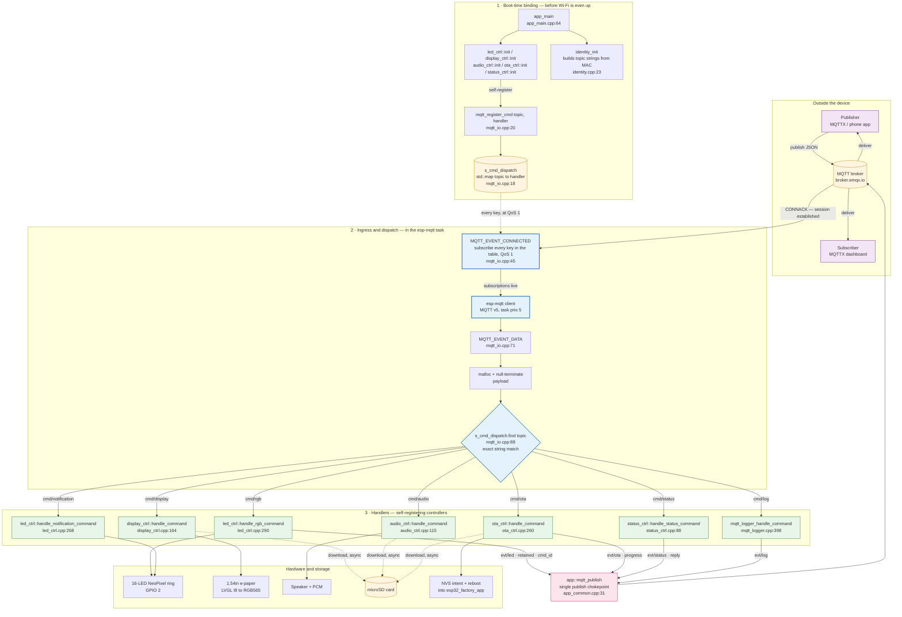
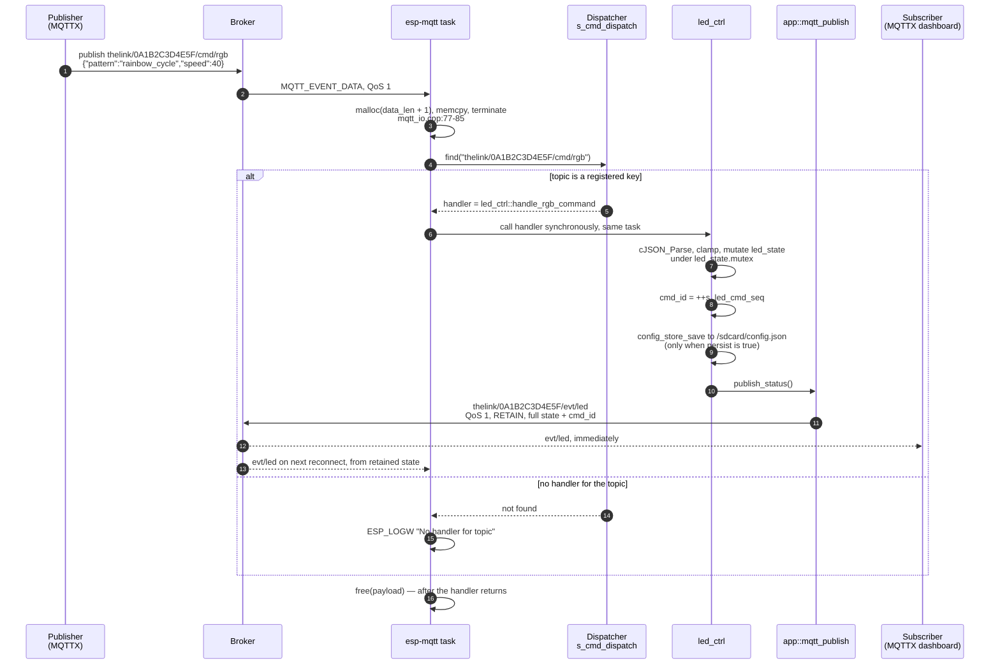

# theLink — architecture

How a message travels from your phone to the e-paper, and how the firmware
decides which piece of hardware should react to it.

The design has one idea at its centre: **the MQTT layer knows nothing about
subsystems.** It owns a lookup table from topic to handler, and each subsystem
registers itself. Adding a new command means adding a registration — no edits to
the MQTT client.

---

## 1. The topic namespace

Every topic is scoped to a single device by its factory MAC address, so many
theLink units can share one broker. `identity_init()` builds all of these strings
once at boot, into fixed 64-byte buffers.

```
thelink/{device_id}/cmd/...     <- the device SUBSCRIBES. you publish here.
thelink/{device_id}/evt/...     <- the device PUBLISHES. you subscribe here.
```

| Inbound `cmd/` topic | Purpose | Replies on |
|---------------------|---------|------------|
| `thelink/{id}/cmd/display` | download + render an image | *(none)* |
| `thelink/{id}/cmd/rgb` | full control of the LED ring | `evt/led` |
| `thelink/{id}/cmd/notification` | LED ring shortcut: pattern on | *(none)* |
| `thelink/{id}/cmd/audio` | download + play a sound | *(none)* |
| `thelink/{id}/cmd/ota` | firmware update | `evt/ota` |
| `thelink/{id}/cmd/log` | change / query log verbosity | `evt/log` |
| `thelink/{id}/cmd/status` | device status query | `evt/status` |

`{id}` is the 6-byte factory MAC as uppercase hex, e.g. `0A1B2C3D4E5F`. Outbound
topics are `evt/led`, `evt/ota`, `evt/status` and `evt/log`. There is no
`evt/display` and no `evt/audio` — those two commands are fire-and-forget today.

---

## 2. Overview: the command path

Three bands, read top to bottom. The middle band is the dispatcher; it is
deliberately thin.



Read the dotted lines as *"happens once at boot"*, the solid edges out of
`lookup` as *"which topic key selects which handler"*, and the bottom path as
*"handlers reply through one helper, then out to the broker"*.

Two properties of this shape are worth stating explicitly:

- **The table is both the routing table and the subscription list.** On every
  `MQTT_EVENT_CONNECTED` the firmware iterates its own dispatch table and
  subscribes to each key. A command cannot be routed but unsubscribed, or the
  reverse.
- **The dispatcher has no knowledge of any subsystem.** `mqtt_io.cpp` never
  mentions the LED, the display, audio or OTA. It only knows
  `std::string → std::function`.

---

## 3. One command, end to end

`cmd/rgb` is the clearest round trip, because it comes back on `evt/led`.



Three things happen here that are easy to miss:

- The handler runs **on the same task and stack** as the MQTT client callback
  (`esp-mqtt`, priority 5, 6 KB). There is no queue between broker and handler.
- `evt/led` is **retained**, so a dashboard that connects five minutes later
  still gets the current ring state without asking.
- `cmd_id` is a **device-local counter**, not an echo of anything the publisher
  sent. It increments only if at least one field parsed successfully.

The `display`, `audio` and `ota` handlers diverge at exactly one point: instead
of mutating hardware directly they call `download::enqueue(url, filename, target)`
and return immediately. The file is fetched on a separate task, and the affected
subsystem is woken when the bytes have landed. That is the whole of their
asynchrony — the MQTT callback is still the thing that parses and validates the
JSON.

---

## 4. Dispatcher mechanics

```cpp
// main/mqtt_io.hpp
using MqttCmdHandler = std::function<void(const char *)>;

// main/mqtt_io.cpp:18
static std::map<std::string, MqttCmdHandler> s_cmd_dispatch;

// main/mqtt_io.cpp:20
void mqtt_register_cmd(const std::string &topic, MqttCmdHandler handler)
{
    s_cmd_dispatch[topic] = std::move(handler);
}
```

The contract in practice:

| Aspect | Behaviour |
|--------|-----------|
| Lookup | `std::map::find` on the full topic string. **Exact match** — no wildcards, no prefix matching. |
| Ordering | The table is populated entirely during `app_main`, before `mqtt_io_start()` runs, and is only read afterwards. That is why it needs no mutex. |
| Re-registration | `operator[]` silently replaces the handler. There is no duplicate detection. |
| Payload | Always a NUL-terminated copy, valid only for the duration of the call. Handlers must not store the pointer. |
| Subscription | Derived: `MQTT_EVENT_CONNECTED` subscribes to every key at QoS 1, and re-runs on each reconnect. |
| Reply | Every reply goes through `app::mqtt_publish()` (`app_common.cpp:31`), which holds the single global client handle. |

The full table, as registered:

| Key | Registered at | Handler |
|-----|---------------|---------|
| `cmd/rgb` | `led_ctrl.cpp:551` | `led_ctrl::handle_rgb_command` |
| `cmd/notification` | `led_ctrl.cpp:552` | `led_ctrl::handle_notification_command` |
| `cmd/display` | `display_ctrl.cpp:260` | `display_ctrl::handle_command` |
| `cmd/audio` | `audio_ctrl.cpp:192` | `audio_ctrl::handle_command` |
| `cmd/ota` | `ota_ctrl.cpp:351` | `ota_ctrl::handle_command` |
| `cmd/status` | `status_ctrl.cpp:97` | `status_ctrl::handle_status_command` |
| `cmd/log` | `mqtt_io.cpp:118` | `mqtt_logger_handle_command` |

---

## 5. Design notes

Where the current design is solid, and where it will bite first.

**Working well**

- The MQTT layer has no subsystem knowledge, and the subscription list cannot
  drift from the routing table.
- Handler registration happens in the controller's own `init()`, next to the
  handler it registers — a new subsystem is one self-contained file.
- Replies are funnelled through one helper, so QoS and retention are decided in
  a single place.

**Sharp edges**

- **Handlers are synchronous.** Anything slow in a handler stalls every other
  command, because they all share the 6 KB `esp-mqtt` task. `cmd/rgb` writes
  `config.json` to the SD card inline when `persist` is true.
- **No acks for `display`, `audio` or `notification`.** They publish nothing, so
  a publisher cannot tell success from failure. Failures in the download
  orchestrator are logged locally and dropped — they never reach the broker.
- **Exact-string matching only.** Subscribing to `cmd/#` for discovery would log
  a warning per message and do nothing. The single `MQTT_EVENT_DATA` path also
  ignores `current_topic_offset` and `total_data_len`, so a payload larger than
  the 1024-byte MQTT buffer would be dispatched on a fragment.
- **No offline signal.** `MQTT_EVENT_DISCONNECTED` only logs. There is no Last
  Will and Testament, so the backend cannot distinguish "device is idle" from
  "device is gone". The UI Wi-Fi icon tracks the Wi-Fi link, not the broker
  link, so it can read "connected" while MQTT is down.
- **The `evt/` namespace is split across two modules.** `evt/log` is the one
  topic not built by `identity_init()` — the logger component reconstructs it
  with `snprintf` on every log line.
- **`cmd_id` is local and LED-only.** No inbound command accepts a request id,
  so there is no way to correlate a specific `cmd/display` with its outcome.

If the first two items in that list are the ones worth fixing, the natural next
step is an async dispatch boundary — a queue in front of the handlers, mirroring
the one `download_mgr` already uses for downloads — plus an `evt/display` and
`evt/audio` acknowledgement carrying the `cmd_id` back.
