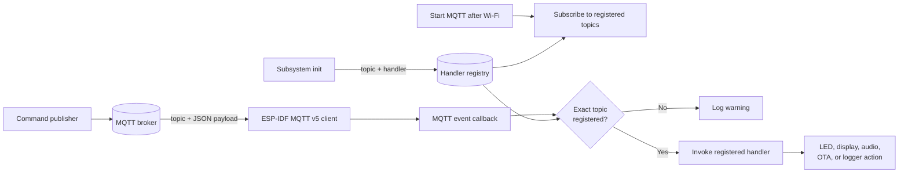
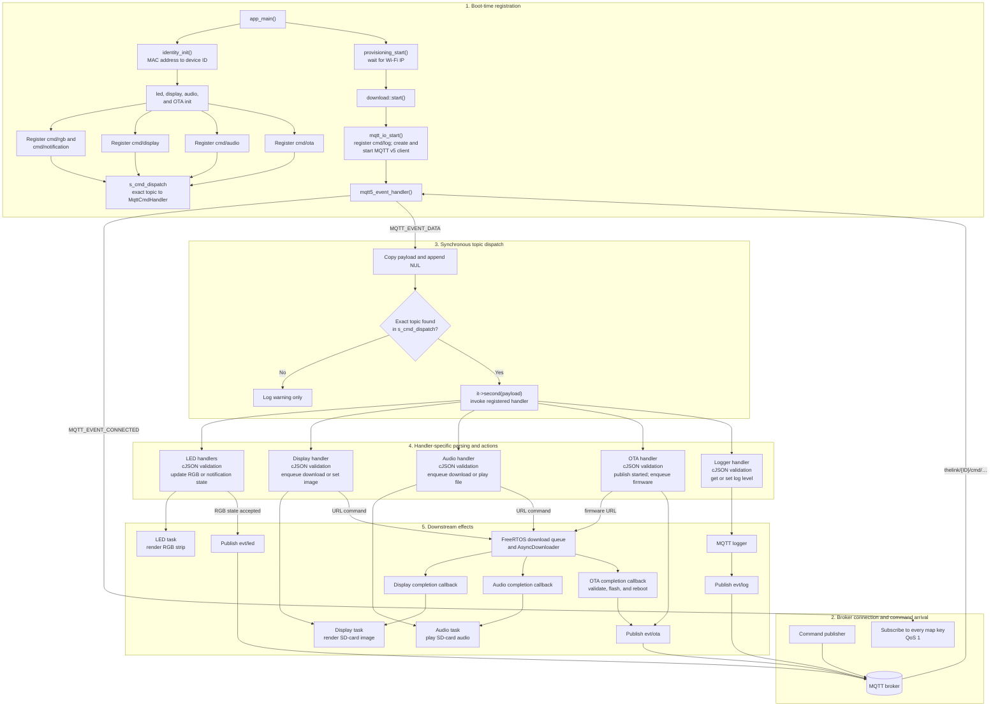

# MQTT command routing

The application routes commands by their **exact MQTT topic**. Subsystems register a topic-to-function mapping during boot; after Wi-Fi is ready, the MQTT client subscribes to every registered topic. For each inbound `MQTT_EVENT_DATA`, the dispatcher copies the payload, looks up the topic in the map, and invokes the selected handler synchronously in the MQTT event callback.

## High-level design

The MQTT layer acts as a topic-based router: subsystems populate a handler registry before startup, and each inbound command is dispatched to the function registered for its exact topic.

## Detailed architecture

## Registered routes

| Exact command topic | Handler | Main effect |
|---|---|---|
| `thelink/{ID}/cmd/rgb` | `led_ctrl::handle_rgb_command` | Validates and updates RGB state, optionally persists it, then publishes `evt/led`. |
| `thelink/{ID}/cmd/notification` | `led_ctrl::handle_notification_command` | Validates `message` and updates notification LED state; it does not publish an `evt/led` response. |
| `thelink/{ID}/cmd/display` | `display_ctrl::handle_command` | Validates `download` and `filename`, optionally queues a download, and updates display state. |
| `thelink/{ID}/cmd/audio` | `audio_ctrl::handle_command` | Validates `download`, `filename`, and optional `volume`, then queues or plays audio. |
| `thelink/{ID}/cmd/ota` | `ota_ctrl::handle_command` | Validates the firmware URL, publishes `evt/ota: started`, and queues `update.bin`. |
| `thelink/{ID}/cmd/log` | `mqtt_logger_handle_command` | Handles `get_level` and `set_level`; responses use `evt/log`. |

## Source map

- Device-specific topic construction: `main/identity.cpp:21-42`
- Controller registration before networking: `main/app_main.cpp:63-74`
- Command registry and registration API: `main/mqtt_io.cpp:18-23`, `main/mqtt_io.hpp:8-13`
- Broker-dependent startup: `main/provisioning.cpp:678-701`
- MQTT v5 client creation: `main/mqtt_io.cpp:116-128`
- Subscription creation from registry keys: `main/mqtt_io.cpp:40-49`
- Payload copy, exact lookup, and direct invocation: `main/mqtt_io.cpp:71-100`
- Display, audio, and firmware routing through the download queue: `main/download_mgr.cpp:45-58`, `main/download_mgr.cpp:128-150`

## Routing characteristics

- The topic lookup is exact; there is no wildcard or fallback handler.
- JSON parsing and field validation happen inside the selected handler, not in shared inbound middleware.
- The selected handler runs synchronously on the MQTT event task. Display, audio, and OTA URL commands defer network downloads to the download queue.
- There is no common command authentication, request ID, result envelope, or error response contract.
