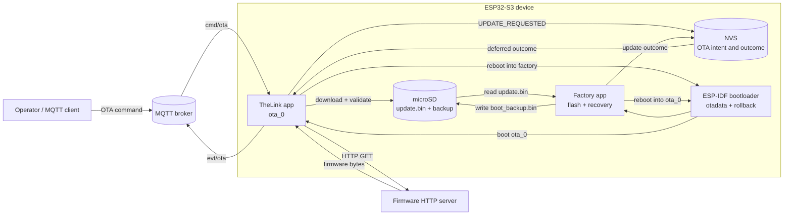
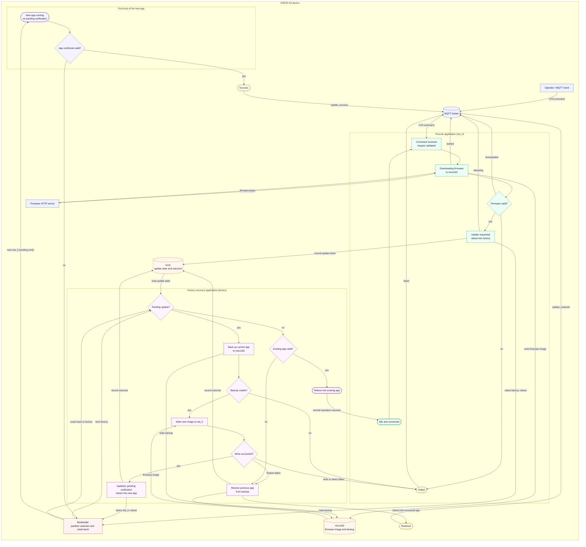

# theLink OTA architecture

These diagrams reflect the production OTA path in the current implementation. TheLink runs from `ota_0`, while the separate `esp32_factory_app` in the `factory` partition performs the flash and recovery work. MQTT carries the command and status events; the firmware image is downloaded directly from the URL supplied in the command.

## Simplified architecture

## Functional states

A download, HTTP, TLS, or SD-card failure ends silently: no `evt/ota` event is published and the device simply stops after `started`. See `## Known gaps and risks`.

## Runtime and recovery paths

1. The operator publishes `thelink/{device-id}/cmd/ota` with a firmware URL. The device validates only the JSON shape and required `download` field, publishes `started`, removes any existing `update.bin`, and enqueues the `FIRMWARE` download.
2. `download_mgr` and `AsyncDownloader` stream the HTTP response into `/sdcard/update.bin`. The main application checks the file size and ESP-IDF image magic byte before allowing the update to proceed.
3. TheLink writes `UPDATE_REQUESTED` to the shared NVS namespace and selects the `factory` partition. The next boot enters the factory application, which creates a CRC-checked SD-card backup of the current `ota_0` image and flashes `update.bin` into `ota_0`.
4. A successful factory flash selects `ota_0` as `PENDING_VERIFY`, records `UPDATE_DONE`, and reboots. TheLink marks the running app `VALID`; once MQTT reconnects, it publishes the deferred `update_success` event.
5. If the first boot of the new app is rolled back by the ESP-IDF bootloader, the factory application detects the invalid `ota_0` and restores `/sdcard/boot_backup.bin`, then reboots into the recovered app. The restored outcome is published after MQTT reconnects.
6. With no pending update, the factory application boots the existing valid `ota_0` image. A production update is a single-slot SD-card recovery design, not a two-slot A/B partition scheme.

## Current implementation boundaries

- The production layout is `factory` (2 MB) plus one `ota_0` slot (5 MB); development builds use `partitions_dev.csv` and do not provide the factory-app OTA path.
- The main application checks only the file size and the ESP-IDF image magic byte (`0xE9`) before handing the file to the factory app; the full ESP-IDF final-image check happens later in `esp_ota_end()` inside `esp32_factory_app`. The OTA path implements no firmware signing, no cryptographic hash verification, and no OTA command authentication, and the repository contains no signing-key files.
- `Server/auth.py`, Redis, and MongoDB are not part of the current OTA path. The HTTP server in the diagram is the arbitrary firmware URL host supplied by the MQTT command.
- OTA event messages are published at QoS 1 without retention. Outcomes that occur while MQTT is unavailable are held in NVS and attempted on the next connection.

## Known gaps and risks

- **Every OTA failure path is silent.** `notify_download_handler` returns early on `success == false` (`main/download_mgr.cpp:47-51`), so the `if (!success)` branch in `ota_ctrl::firmware_downloaded` (`main/ota_ctrl.cpp:302-306`) is dead code. A network error, non-200 response, short read, stream stall, SD write error, or a missing SD card all end the attempt with no `evt/ota` event. The operator sees `started` and then nothing.
- **`https://` firmware URLs cannot work.** `config.cert_pem` and `config.crt_bundle_attach` are both commented out (`main/data_downloader.cpp:81-83`), so TLS setup fails for any HTTPS URL. Combined with the silent-failure path above, this is invisible to the operator. Only `http://` URLs are usable.
- **A stale `update.bin` counts as a completed download.** `download_mgr` treats an existing file as success and skips the transfer (`main/download_mgr.cpp:87-92`), while `AsyncDownloader` creates the file with `fopen(..., "wb")` before the first byte arrives (`main/data_downloader.cpp:21`). A second `cmd/ota` received during an in-flight transfer can therefore hand a partially written image to validation.
- **Malformed commands get no reply.** Invalid JSON or a missing `download` field is logged and discarded with no `evt/ota` event (`main/ota_ctrl.cpp:264-276`). The optional `version` field is written to the serial log only and never appears in any event payload.
- **Stale update intents are cleared silently.** A `REQUESTED` or `IN_PROGRESS` state still present at boot is reset to `NONE` with no event (`main/ota_ctrl.cpp:342-346`), so an abandoned update is invisible to the operator.
- **Deferred outcomes can be lost.** The NVS state is cleared before the publish is attempted (`main/ota_ctrl.cpp:165-166`), and holding the factory-reset button at boot erases the whole NVS partition (`main/app_main.cpp:90`), discarding a recorded `UPDATE_DONE` or `UPDATE_RESTORED`.
- **Flash failures are not handled uniformly.** Only an `esp_ota_end()` failure restores the backup (`esp32_factory_app/main/update.cpp:510-516`); `esp_ota_begin`, `esp_ota_write`, and `esp_ota_set_boot_partition` failures record `UPDATE_FAILED` and leave the factory app idle. A successful restore then overwrites that failure reason with `UPDATE_RESTORED` (`esp32_factory_app/main/update.cpp:335`), so the flash error never reaches MQTT.
- **The restore path can loop forever.** The restored image is itself left `PENDING_VERIFY` and no attempt counter exists, so a bad backup can cycle crash-back, restore, and reboot indefinitely (`esp32_factory_app/main/main.cpp:77-78`, `esp32_factory_app/main/update.cpp:341`).
- **Booting the existing app re-arms rollback.** `boot_existing_link_app` calls `esp_ota_set_boot_partition` (`esp32_factory_app/main/update.cpp:360-387`), which rewrites the `ota_0` otadata entry as `NEW`. An already-validated app is therefore placed back under first-boot supervision, and a later failure rolls back into the same destructive restore path.
- **`scripts/build.py -p Prod flash` overwrites the factory app.** The Prod build's flasher args write `theLink_esp32s3.bin` at `0x10000`, which is the `factory` partition, and never write `ota_0` at `0x210000` (`build/flasher_args.json`). Production provisioning must use `scripts/flash_all.py`, which writes the factory app and the main app at their correct offsets.
- **Firmware URLs are silently truncated at 255 characters** (`main/download_mgr.cpp:16`, `main/download_mgr.cpp:137`), which turns a long URL into a failed request with no error event.
- **The OTA command is unauthenticated and the broker is public.** The default broker is `mqtt://broker.emqx.io` with no credentials and no TLS (`main/Kconfig.projbuild:3-7`), so anyone who knows a device ID can command an update. This is the most significant security exposure in the design.
- **The magic-byte check can be skipped.** The file is reopened for the `0xE9` check with an `if (f != nullptr)` guard and no `else` branch (`main/ota_ctrl.cpp:203-215`), so a failed reopen silently accepts the file.

## Source map

- OTA command, validation, NVS handshake, boot partition selection, and deferred events: `main/ota_ctrl.cpp:99`, `main/ota_ctrl.cpp:170`, `main/ota_ctrl.cpp:260`, `main/ota_ctrl.cpp:310`
- OTA topic registration and boot-time result handling: `main/ota_ctrl.cpp:349`
- MQTT topic dispatch and subscriptions: `main/mqtt_io.cpp:44`, `main/mqtt_io.cpp:88`
- Device-specific topic construction: `main/identity.cpp:43`, `main/identity.cpp:49`
- Download queue and FIRMWARE callback: `main/download_mgr.cpp:45`, `main/download_mgr.cpp:60`, `main/download_mgr.cpp:128`
- HTTP-to-SD streaming: `main/data_downloader.cpp:15`, `main/data_downloader.cpp:71`, `main/data_downloader.cpp:217`
- SD card mounting and file layout: `components/sdcard_manager/sdcard_manager.cpp:24`
- Initial application boot and Wi-Fi/MQTT startup: `main/app_main.cpp:64`, `main/app_main.cpp:130`, `main/provisioning.cpp:699`
- Production partition layout: `partitions.csv:4`
- Initial full-stack flashing: `scripts/flash_all.py:172`
- Factory flashing, backup, and restore: `esp32_factory_app/main/update.cpp:205`, `esp32_factory_app/main/update.cpp:249`, `esp32_factory_app/main/update.cpp:389`
- Factory recovery decision flow: `esp32_factory_app/main/main.cpp:53`, `esp32_factory_app/main/main.cpp:77`
